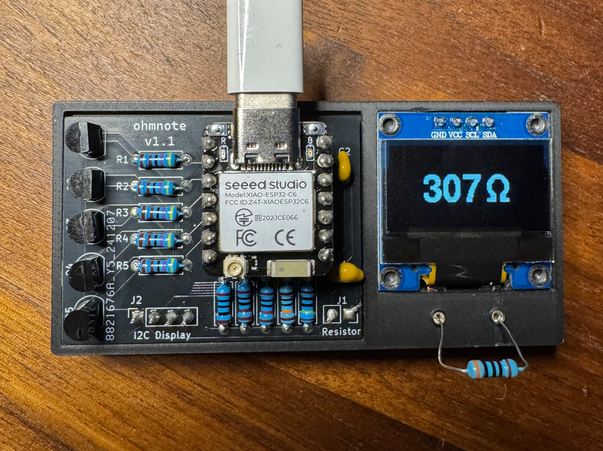
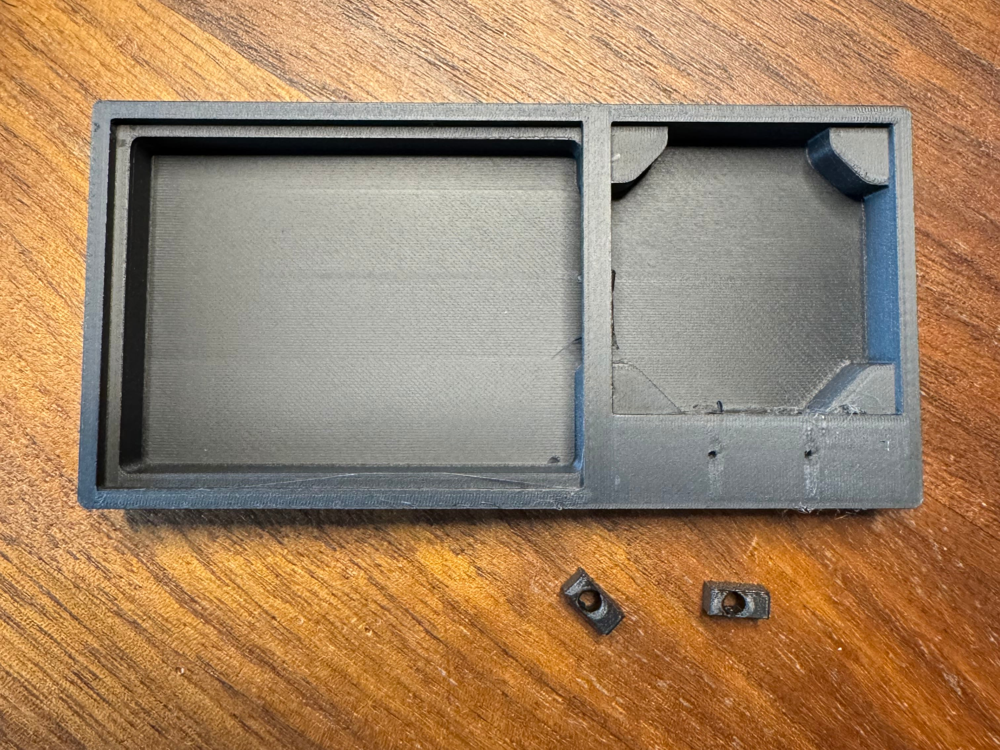
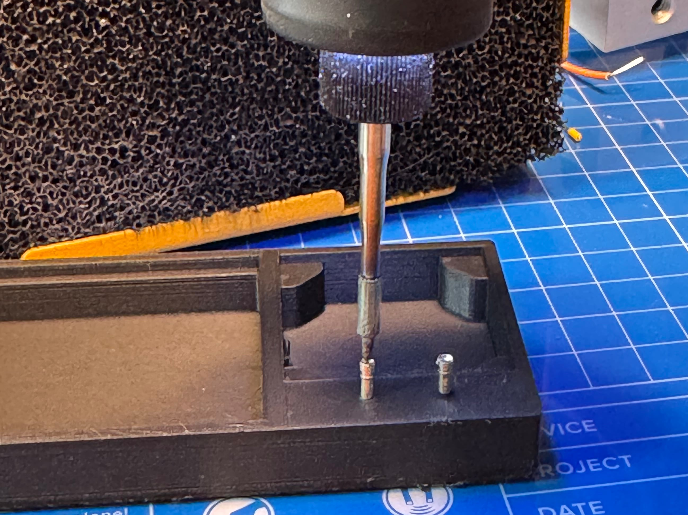
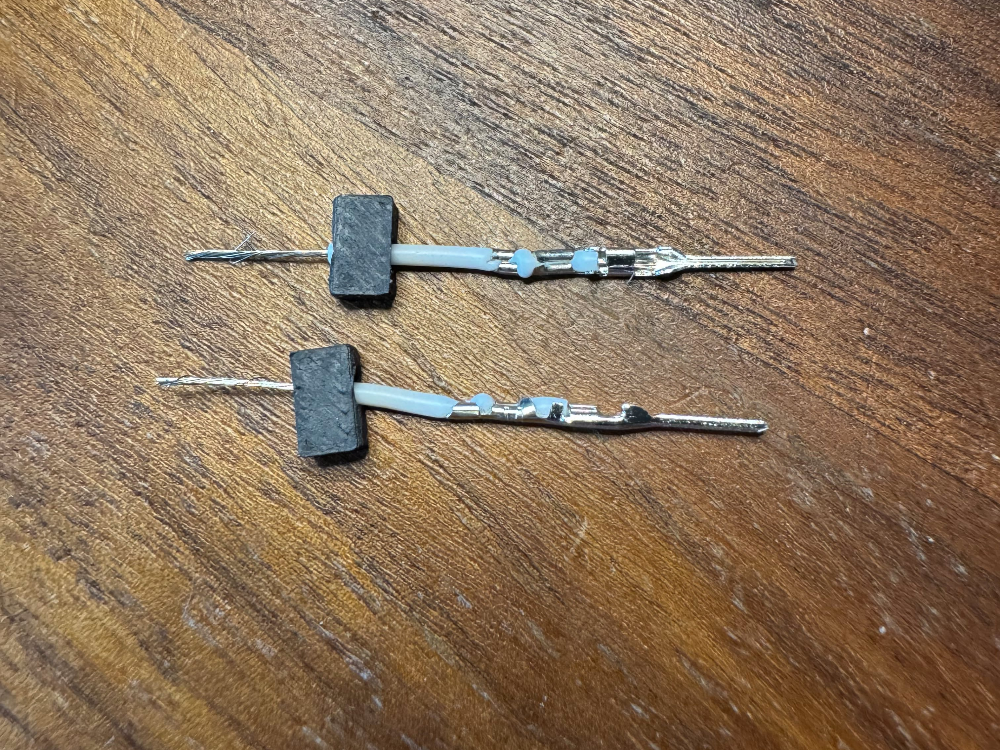
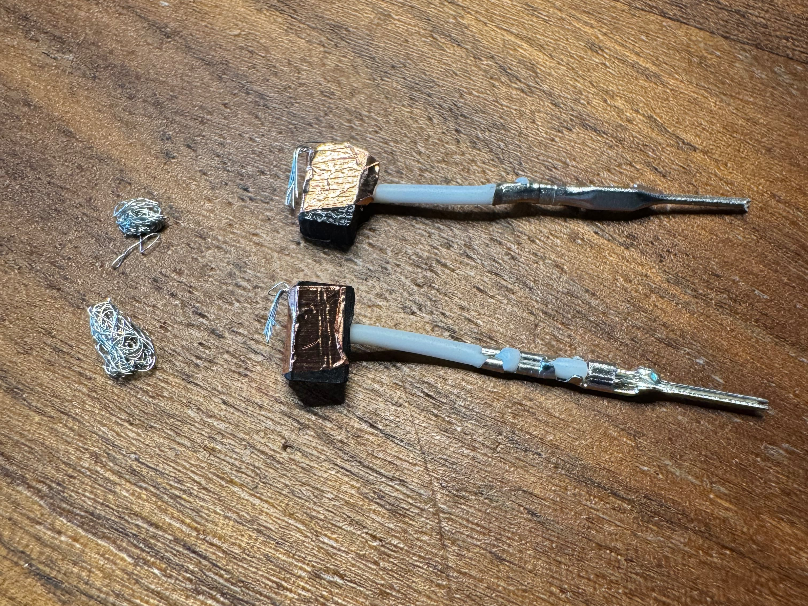
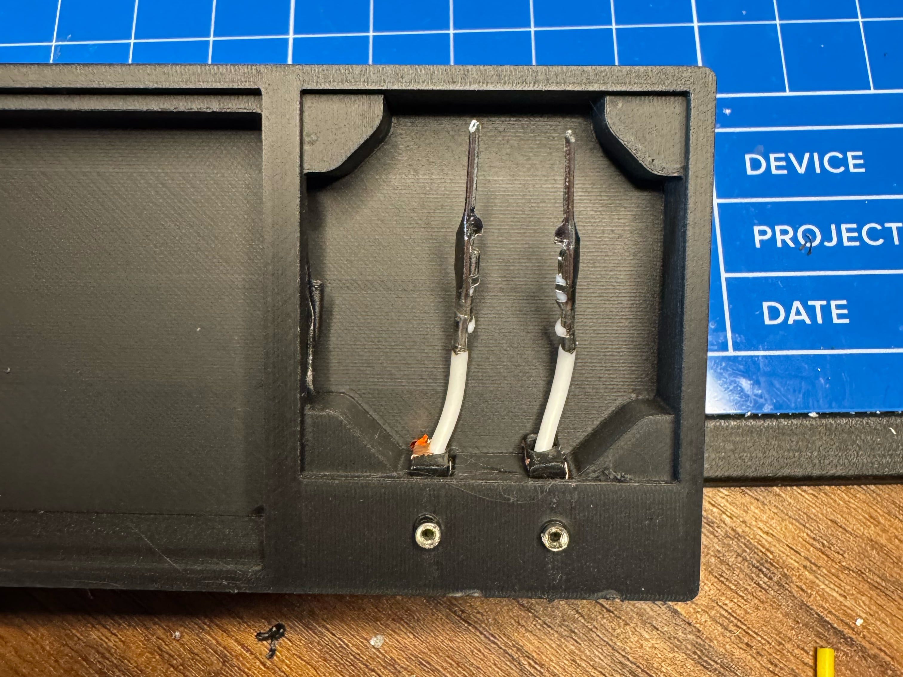
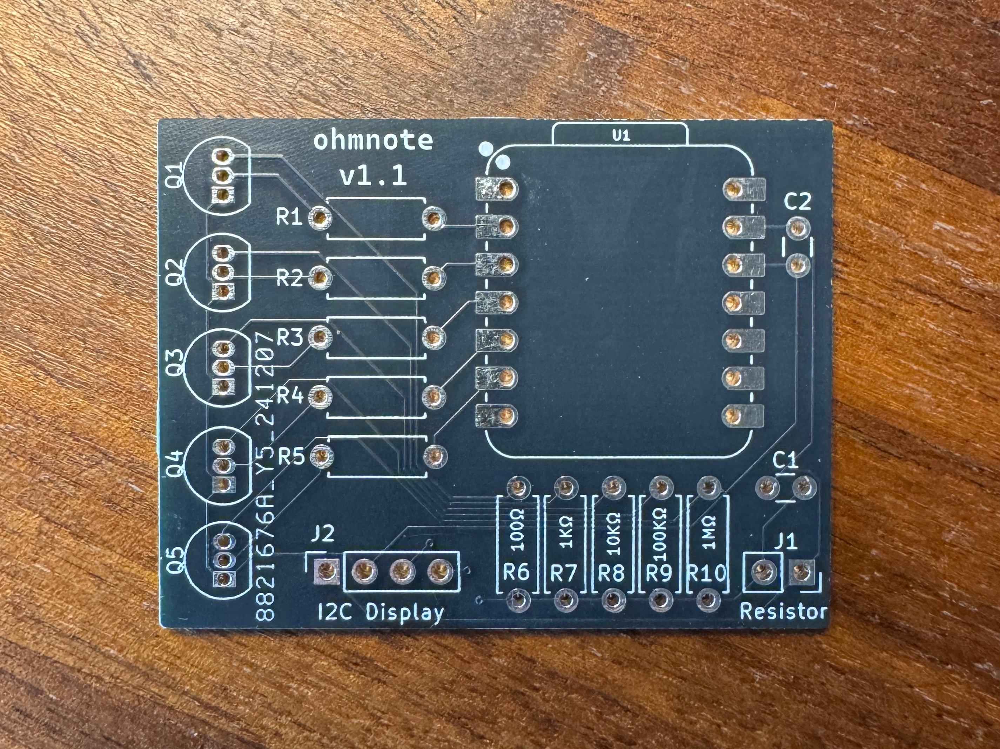
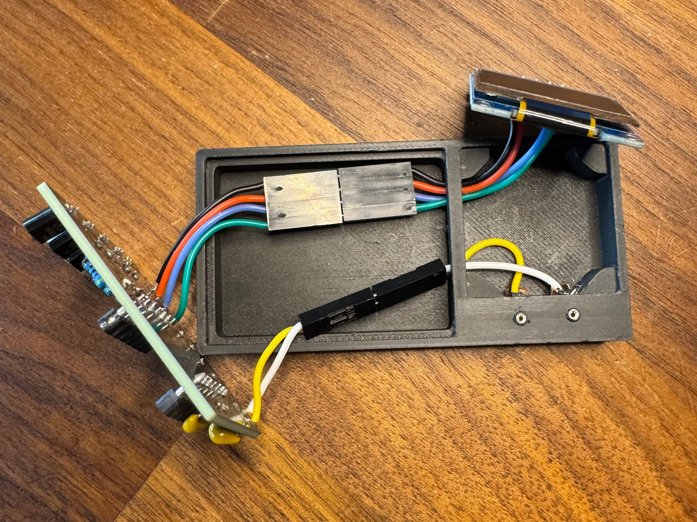

# ohmnote

A little ohmmeter.



I wrote it in rust but it was adapted from: https://simple-circuit.com/arduino-auto-ranging-ohmmeter-lcd and https://www.hackster.io/Costalegre/auto-ranging-ohmmeter-6fa4af.

If you want to make it yourself, you can use the PCB files in the Gerbers/ directory and the 3D model in ohmnote.3mf.

## BOM

- **5** 4.7KΩ resistors
- **1** 1MΩ resistor
- **1** 100KΩ resistor
- **1** 10KΩ resistor
- **1** 1KΩ resistor
- **1** 100Ω resistor
- **5** BJT PNP transistors (i used 2N3906 and don't know enough about transistors to be able to say what else might work)
- **2** 100nf capacitors
- **1** SSD1306 OLED screen (i used [this one](https://www.amazon.com/gp/product/B09T6SJBV5/ref=ppx_yo_dt_b_search_asin_title?ie=UTF8&psc=1))
- **2** Header sockets
- Some stranded wires
- Some copper tape

## Assembly

### Print out the parts



### Push the headers into the holes on the main part

I used my soldering iron on the lowest heat setting and they just sank in.



### Push some wire through the nubbins

These will get pushed into the slots under the headers



### Secure the loose strands with copper tape



### Push some other loose strands + the taped nubbins into the body

I also pushed some extra loose strands into the holes to make sure everything was conducting.



### Get a PCB

I use [JLCPCB](https://jlcpcb.com) personally but you do you!



### Solder everything to the pcb

You can use the schematic to see what goes where.

(I didn't take a picture of this but like, you can just look at the other pictures of the board)

### Connect all the wires

I crimped everything so it'd be easier to take apart if I messed something up, but you could just solder all the
wires directly if you want.



### Flash the code from this repo to the XIAO board

```sh
$ cargo run --release
```

### You're done!
